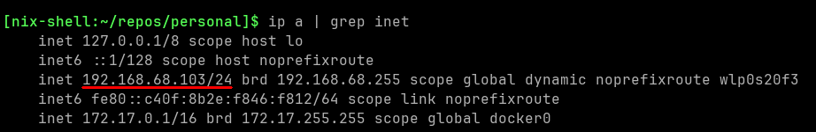

# TLS 4 Dummies

## Gerando uma Chave Privada

Para entender como gerar uma chave privada, primeiro é preciso saber o que é uma chave privada.

### O que é uma Chave Privada?

Uma **chave privada** é uma chave secreta usada em **Criptografia Assimétrica**. Ela é emparelhada com uma **chave pública** e serve para criptografar e descriptografar mensagens com segurança.

### Por que Você Precisa de Uma?

Você precisa de uma chave privada para:

1. **Criptografar informações** que só podem ser descriptografadas por quem possuir a chave pública correspondente.  
2. **Assinar certificados** que comprovam a identidade do seu servidor (ao configurar um certificado TLS/SSL).

### Passo a Passo

#### 1. Instalar o OpenSSL

OpenSSL é uma ferramenta usada para criar certificados TLS, incluindo a chave privada. Ele já vem instalado na maioria dos sistemas Unix (como Linux ou macOS), mas se você estiver usando Windows, pode ser necessário instalá-lo manualmente.

* Em **Linux** ou **macOS**, o OpenSSL já deve estar disponível no terminal. Você pode checar digitando:

  ```bash
  openssl --version
   ```


* No **Windows**, você pode baixar o OpenSSL [aqui](https://slproweb.com/products/Win32OpenSSL.html).

#### 2. Gerar a Chave Privada

Agora estamos prontos para gerar a chave privada. Este passo cria um arquivo que somente você (ou seu servidor) pode usar. Gere uma chave RSA com o comando:

```bash
openssl genpkey -algorithm RSA -out private.key -aes256
```

Que significa:

* `openssl genpkey`: diz ao OpenSSL para gerar uma chave.
* `-algorithm RSA`: especifica o algoritmo RSA para a chave privada.
* `-out private.key`: salva a chave privada no arquivo `private.key`.
* `-aes256`: criptografa a chave privada com AES-256.

> Observação: você será solicitado a criar uma senha para o arquivo da chave. Se não quiser protegê-la com senha, omita `-aes256`.


#### 3. Verificar a Chave Privada

Depois de gerar a chave privada, verifique-a com:

```bash
openssl pkey -in private.key -text -noout
```

Isso exibirá detalhes da chave, como tamanho e metadados. Se aparecerem informações, a chave foi criada com sucesso!

#### 4. Segurança da Chave Privada

* **Mantenha sua chave privada segura!** Ela **nunca** deve ser compartilhada.
* Armazene-a em local seguro e defina permissões restritas no arquivo.

## Criando Sua Autoridade Certificadora (CA)

### O que é uma Certificate Authority (CA)?

Uma **Autoridade Certificadora (CA)** é uma entidade confiável que emite certificados digitais, autenticando identidades e garantindo comunicação segura.

Em contexto público, CAs conhecidas como **Let's Encrypt**, **DigiCert** ou **Comodo** emitem certificados para sites. Para uso interno, você pode criar sua própria CA e assinar certificados com ela.

### Por que Criar Sua Própria CA?

1. **Redes privadas**: não é necessário depender de CAs públicas.
2. **Controle total**: você define quem confia e como os certificados são emitidos ou revogados.
3. **Sem custos**: não há taxas de uma CA pública.

### Passo a Passo

#### 1. Criar um Certificado Raiz Autoassinado (CA)

O certificado raiz é o certificado público usado por sua CA para assinar outros certificados. Clientes confiarão nele quando o conhecerem.

Crie o **certificado raiz** com:

```bash
openssl req -key private.key -new -x509 -out ca-cert.pem -days 3650
```

Explicando:

* `openssl req`: cria uma solicitação de assinatura de certificado (CSR).
* `-key private.key`: usa a chave privada gerada para sua CA.
* `-new`: gera uma nova CSR.
* `-x509`: gera um certificado autoassinado (torna-o raiz).
* `-out ca-cert.pem`: define o arquivo de saída.
* `-days 3650`: validade de 10 anos (ajustável).

Será solicitado o preenchimento de dados (país, organização, etc.). O campo **Common Name (CN)** pode ser algo como "Minha CA" ou o nome que preferir.


#### 2. Verificar o Certificado Raiz

```bash
openssl x509 -in ca-cert.pem -text -noout
```

Isso mostra detalhes como data de expiração e chave pública. Se estiver tudo certo, sua CA está pronta.

## Criando o Certificado do Servidor

### O que é um Certificado de Servidor?

Um **certificado de servidor** comprova a identidade do servidor para os clientes. Ele contém a chave pública e detalhes de identidade do servidor. Normalmente é assinado por uma CA confiável; aqui usaremos sua própria CA.

### Por que Preciso de um Certificado de Servidor?

1. **Autenticação do servidor**.
2. **Criptografia da comunicação**.
3. **Evitar ataques Man-in-the-Middle**.

### Passo a Passo

#### 1. Criar a CSR (Certificate Signing Request)

```bash
openssl req -new -key private.key -out server.csr
```

* `openssl req`: gera uma CSR.
* `-new`: nova CSR.
* `-key private.key`: chave privada correspondente.
* `-out server.csr`: saída `server.csr`.

Ao executar, preencha:

* **Country, State, Locality, Organization, OU**
* **Common Name (CN)**: normalmente FQDN, mas em rede interna pode usar o **IP**.
  
* **Email** (opcional).


#### 2. Assinar o Certificado com Sua CA

```bash
openssl x509 -req -in server.csr -CA ca-cert.pem -CAkey private.key -CAcreateserial -out server-cert.pem -days 3650
```

* `openssl x509 -req`: cria o certificado a partir da CSR.
* `-in server.csr`: CSR criada.
* `-CA ca-cert.pem`: certificado raiz.
* `-CAkey private.key`: chave da CA.
* `-CAcreateserial`: cria arquivo de série.
* `-out server-cert.pem`: certificado assinado.
* `-days 3650`: validade de 10 anos.


#### 3. Verificar o Certificado do Servidor

```bash
openssl x509 -in server-cert.pem -text -noout
```

Se tudo estiver correto, o certificado está pronto.

#### 4. Instalar o Certificado no Servidor

Instale `server-cert.pem` e `private.key` no seu servidor conforme o software utilizado.

#### 5. Garantir que a CA é Confiável

Instale `ca-cert.pem` nos clientes para que confiem nos certificados assinados por ela.

##### Google Chrome (Windows/macOS)

1. **Configurações → Avançado → Segurança → Gerenciar certificados**.
2. **Importar** em **Trusted Certificates** e selecione `ca-cert.pem`.
3. Reinicie o navegador.

##### Mozilla Firefox (Windows/macOS)

1. **Configurações → Privacidade & Segurança → Certificados → Ver Certificados**.
2. Aba **Authorities → Import** → `ca-cert.pem`.
3. Marque **Trust this CA to identify websites**.
4. Reinicie o Firefox.


## Criando um Servidor HTTPS em Python

Com `private.key`, `ca-cert.pem` e `server-cert.pem`, vamos configurar um servidor HTTPS básico em Python usando o módulo `http.server`.

### Passo a Passo

#### 1. Verificar o Python

```bash
python3 --version
```

Se necessário, baixe em [python.org](https://www.python.org/downloads/).

#### 2. Escrever o Script `https_server.py`

```python
import http.server
import ssl

# Endereço e porta
server_address = ("", 4443)

# Servidor HTTP
httpd = http.server.HTTPServer(server_address, http.server.SimpleHTTPRequestHandler)

# Contexto SSL
context = ssl.create_default_context(ssl.Purpose.CLIENT_AUTH)
context.load_cert_chain(certfile="server-cert.pem", keyfile="private.key")

# Envelopa o socket com TLS
httpd.socket = context.wrap_socket(httpd.socket, server_side=True)

print("Starting HTTPS server on port 4443...")
httpd.serve_forever()
```

#### 3. Acessar o Servidor

Abra o navegador em `https://[IP PRIVADO]:4443`.

> Pode aparecer um **aviso de segurança** por ser autoassinado com IP. Ignore para este tutorial.

#### 4. Verificar a Conexão Segura

1. **URL** deve começar com `https://`.
2. **Certificado**:

   * **Chrome**: cadeado → **Certificate**.
   * **Firefox**: cadeado → **More Information** → **View Certificate**.

   

## Alternativa com Node.js e Forge

Você também pode gerar uma Autoridade Certificadora e assinar certificados diretamente com JavaScript usando o pacote `node-forge`.

### Dependências
Para executar essa alternativa, é necessário instalar as bibliotecas que permitem gerar os certificados e rodar o servidor seguro:

#### Para geração de certificados com JavaScript:

```bash
npm install node-forge
```

Essa biblioteca é usada para gerar, assinar e exportar certificados diretamente em Node.js, simulando uma autoridade certificadora (CA) local.

#### Para rodar o servidor HTTPS com Python (Flask):

```bash
pip install flask
```

O Flask será utilizado como servidor backend, configurado para usar os certificados gerados e servir via HTTPS.

### Geração de Certificados

Para geração dos certificados foram seguidos os seguintes passos:

1. **Criação da CA**: o script gera um par de chaves RSA para a Autoridade Certificadora (CA), cria um certificado digital autoassinado para ela e o salva como `ca-cert.pem`. Este certificado é o que será importado nos navegadores como "confiável".

2. **Criação do certificado do servidor**: um segundo par de chaves é gerado para o servidor. O certificado do servidor é construído com as informações de identificação e assinado digitalmente pela chave da CA. O resultado é um certificado `server-cert.pem` que é confiável para qualquer cliente que tenha importado a CA.

3. **Extensões e SANs**: o certificado do servidor inclui extensões como `subjectAltName`, com valores para `localhost` e `127.0.0.1`, e restrições como `keyUsage` e `extKeyUsage`, garantindo validade para uso como TLS.

Para rodar esse script é necessário o seguinte comando:

```bash
node generate-certs-forge.js
```

### Configuração do Servidor

Os arquivos `server-cert.pem` e `server-key.pem` são utilizados para configurar uma aplicação servidor com HTTPS. No Flask, essa configuração foi feita da seguinte forma:

```python
app.run(ssl_context=("certs/server-cert.pem", "certs/server-key.pem"), port=4443)
```

O mesmo certificado pode ser utilizado em servidores Node.js, Express, ou qualquer outro software compatível com TLS.

Para iniciar o servidor é necessário executar o seguinte comando:

```python
python server.py
```

### Configuração do Cliente

O cliente é o navegador, e para que ele aceite o certificado gerado, é necessário importar o certificado da CA (`ca-cert.pem`) nas configurações de certificados do sistema ou do próprio navegador (em Firefox e Chrome).

No Firefox, por exemplo:

1. Acesse as configurações → Privacidade e Segurança → Certificados → Ver Certificados
2. Vá na aba "Autoridades"
3. Clique em "Importar" e selecione `ca-cert.pem`
4. Marque "Confiar nesta CA para identificar sites"

Com isso, qualquer certificado assinado pela CA será reconhecido como confiável.

### Teste da Conexão

Após rodar o servidor e importar a CA, ao acessar `https://localhost:4443`, o navegador exibirá o cadeado verde indicando que a conexão é segura. O certificado será exibido como "válido" pois foi emitido por uma autoridade que o navegador agora confia.


#### Observação

Se o navegador exibia "conexão não segura" antes, é porque o certificado era **autoassinado**. Com essa nova abordagem, ele é **assinado por uma CA** separada e confiável, e portanto passa a ser aceito pelo navegador sem avisos.

### Manutenção e Segurança

Ao gerar e operar sua própria Autoridade Certificadora (CA), é possível controlar todo o ciclo de vida dos certificados utilizados em sua infraestrutura. Isso permite a adoção de práticas essenciais de segurança e gestão de identidades digitais, como:

* **Renovação de certificados**: Certificados possuem prazo de validade. A renovação periódica evita interrupções na comunicação segura e assegura a continuidade das operações.
* **Revogação de certificados comprometidos**: Em caso de comprometimento de uma chave privada ou mau uso do certificado, é possível invalidá-lo por meio de mecanismos como CRLs (Certificate Revocation Lists) ou OCSP (Online Certificate Status Protocol).
* **Emissão de múltiplos certificados**: A CA pode ser utilizada para emitir diferentes certificados para múltiplos serviços ou ambientes internos, mantendo uma cadeia de confiança comum.
* **Reemissão com novos parâmetros criptográficos**: Caso se deseje atualizar o nível de segurança, é possível emitir certificados com novos algoritmos ou tamanhos de chave, como a migração de RSA-2048 para RSA-4096.

Esse tipo de abordagem é especialmente adequado para:

* **Ambientes de desenvolvimento e testes**, onde a confiabilidade de uma CA pública não é necessária e a flexibilidade é essencial;
* **Laboratórios de segurança**, nos quais se estuda o comportamento de aplicações diante de certificados expirados, revogados ou inválidos;
* **Redes privadas e sistemas internos**, em que a criação de uma infraestrutura própria de confiança permite maior controle e menor dependência externa.

Portanto, ao adotar uma CA local, é possível simular fielmente uma cadeia de confiança semelhante à utilizada em ambientes de produção, promovendo boas práticas de segurança da informação desde a fase de desenvolvimento.

## Conclusão

Você criou um **servidor HTTPS seguro**, aprendeu duas formas de gerar certificados (com OpenSSL e com Node.js), e entendeu como funciona a cadeia de confiança com CA raiz e certificados assinados. Isso te dá autonomia para usar TLS em ambientes reais e seguros.
